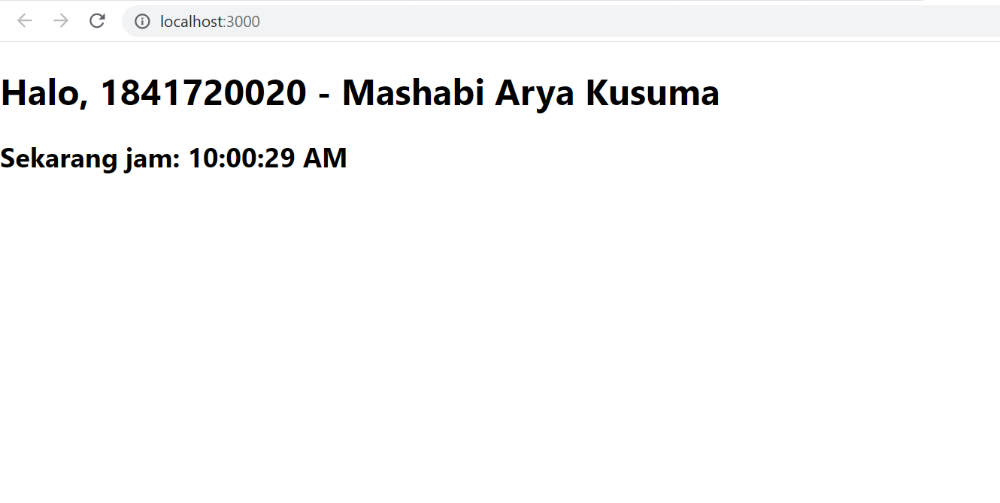

# 03 - Konsep ReactJS

## Tujuan Pembelajaran

1. Mahasiswa memahami konsep dasar ReactJS
2. Mahasiswa dapat membuat komponen dalam ReactJS

## Hasil Praktikum

### Praktikum 1

[Source Code index.js](../../src/03_konsep_reactjs/praktikum1/index.js)
  

### Praktikum 2

[Source Code index.js](../../src/03_konsep_reactjs/praktikum2/index.js)
  

### Praktikum 3

[Source Code index.js](../../src/03_konsep_reactjs/praktikum3/index.js)
  

### Praktikum 4

[Source Code index.js](../../src/03_konsep_reactjs/praktikum4/index.js)

[Source Code App.js](../../src/03_konsep_reactjs/praktikum4/App.js)
  
  

### Praktikum 5

[Source Code App.js](../../src/03_konsep_reactjs/praktikum5/App.js)
  

### Praktikum 6

[Source Code index.js](../../src/03_konsep_reactjs/praktikum6/index.js)
  