# 04 - Konsep ReactJS Bagian 2

## Tujuan Pembelajaran

1. Mahasiswa memahami konsep interaksi dalam ReactJS
2. Mahasiswa dapat membuat interaksi ReactJS dengan API

## Hasil Praktikum

### Praktikum 1

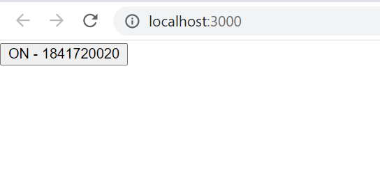

[Source Code index.js Cara 1](../../src/04_konsep_reactjs_part2/praktikum1/index-cara1.js)
  

[Source Code index.js Cara 2](../../src/04_konsep_reactjs_part2/praktikum1/index-cara2.js)
  

[Source Code index.js Cara 3](../../src/04_konsep_reactjs_part2/praktikum1/index-cara3.js)
  

### Praktikum 2

Jika true
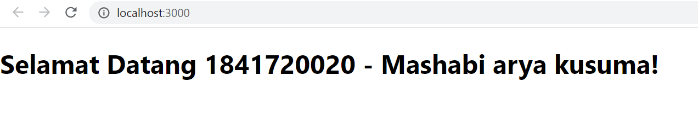
  

Jika false
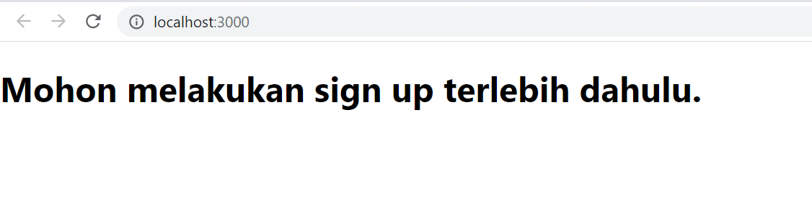

[Source Code index.js](../../src/04_konsep_reactjs_part2/praktikum2/index.js)
  

### Praktikum 3

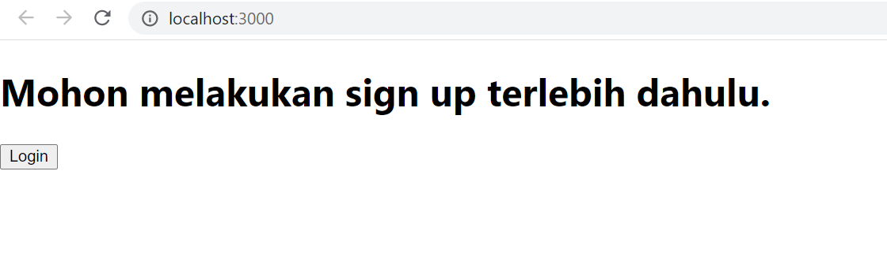
  

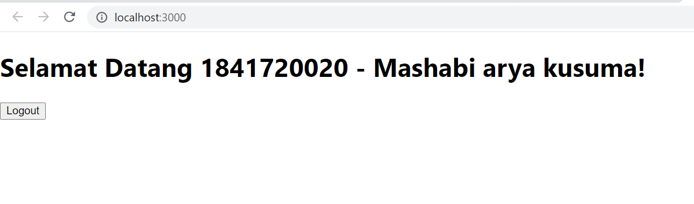

[Source Code index.js](../../src/04_konsep_reactjs_part2/praktikum3/index.js)
  

### Praktikum 4

Warning pada console
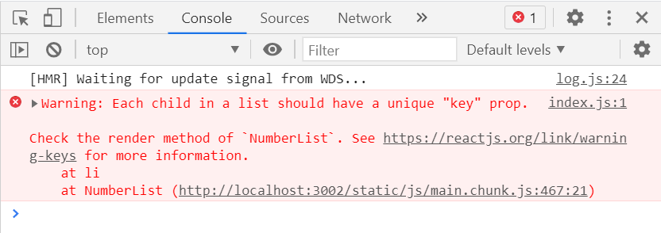
  

Tanpa Warning
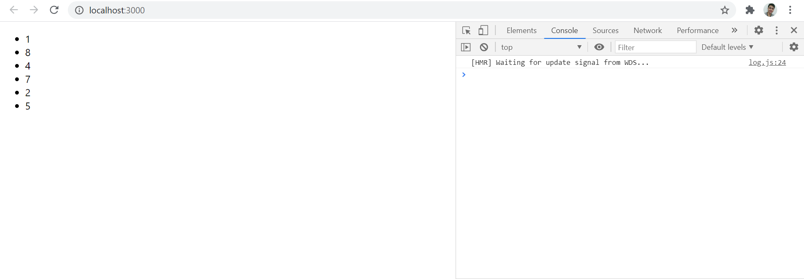

[Source Code index.js](../../src/04_konsep_reactjs_part2/praktikum4/index.js)
  

### Praktikum 5

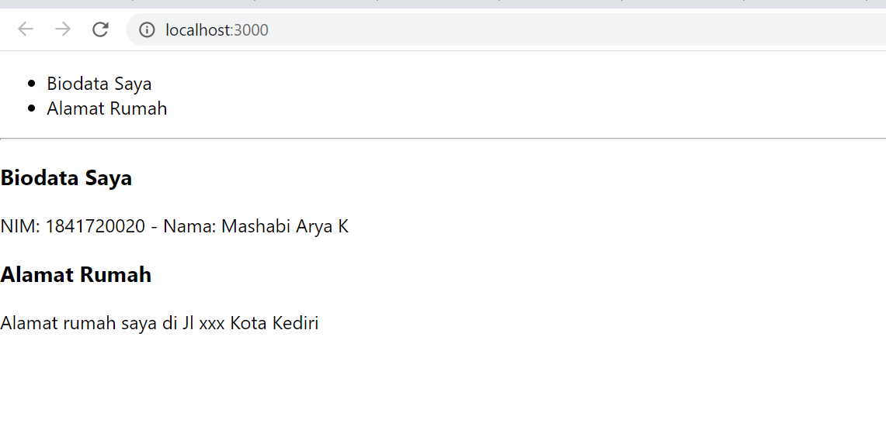

[Source Code index.js](../../src/04_konsep_reactjs_part2/praktikum5/index.js)
  

### Praktikum 6

### 1. Index Form

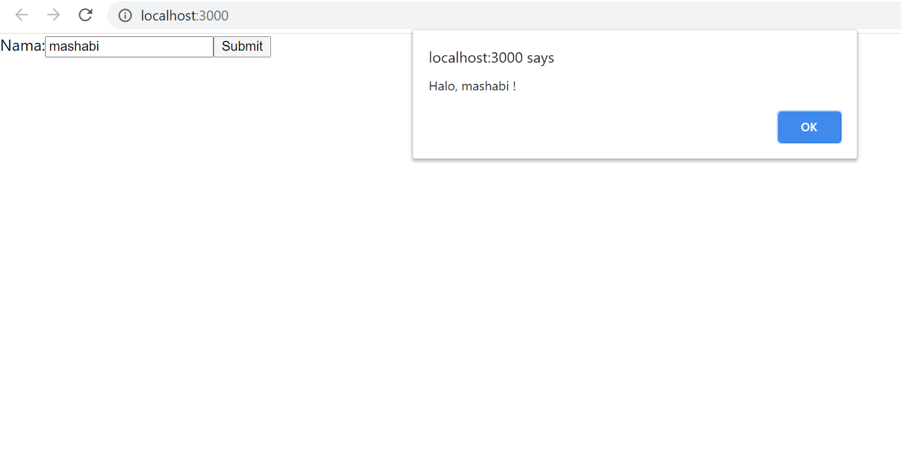

[Source Code index-form.js](../../src/04_konsep_reactjs_part2/praktikum6/index-form.js)
  

### 2. Text Area

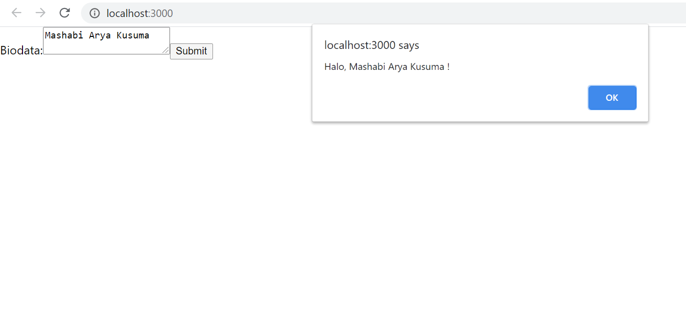

[Source Code index-textarea.js](../../src/04_konsep_reactjs_part2/praktikum6/index-textarea.js)
  

### 3. Select

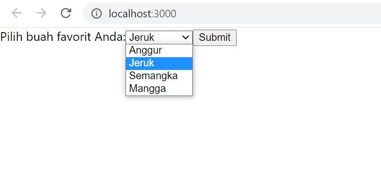

[Source Code index-textarea.js](../../src/04_konsep_reactjs_part2/praktikum6/index-select.js)
  

### 4. Multiple Select

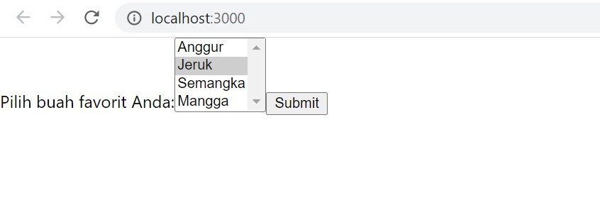

[Source Code index-mulriple-select.js](../../src/04_konsep_reactjs_part2/praktikum6/index-multiple-select.js)
  