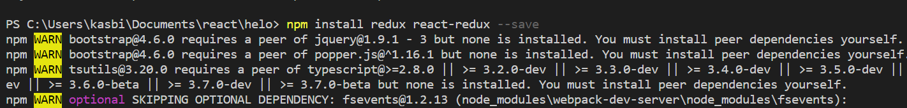
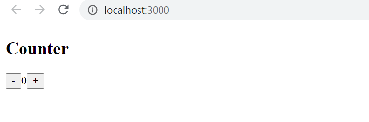
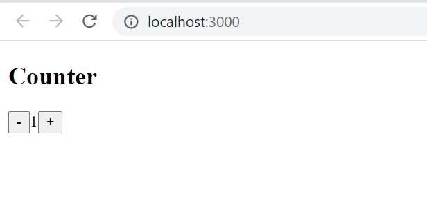
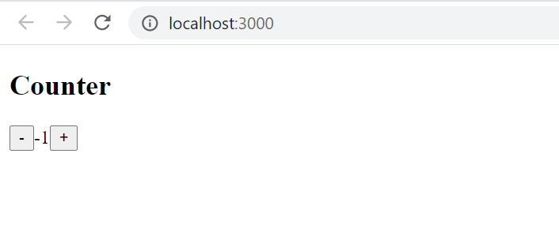
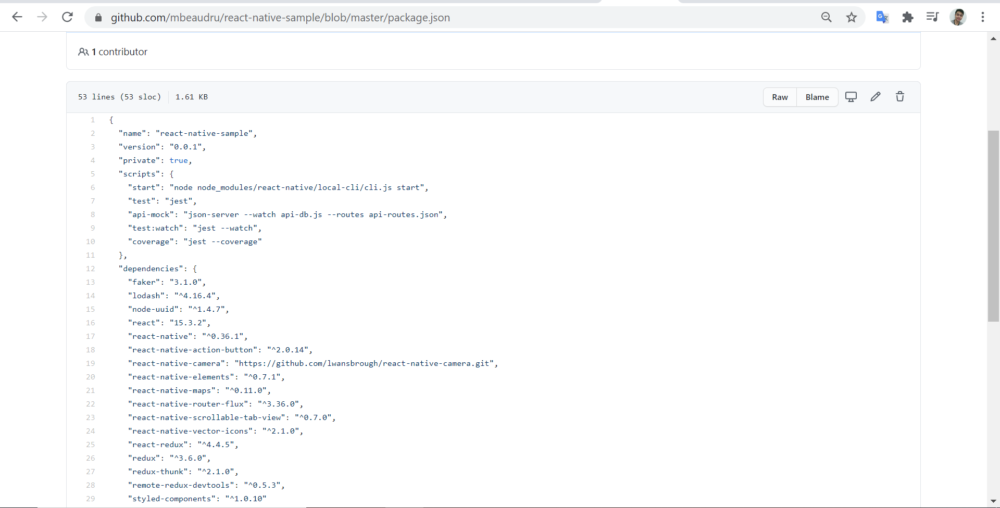
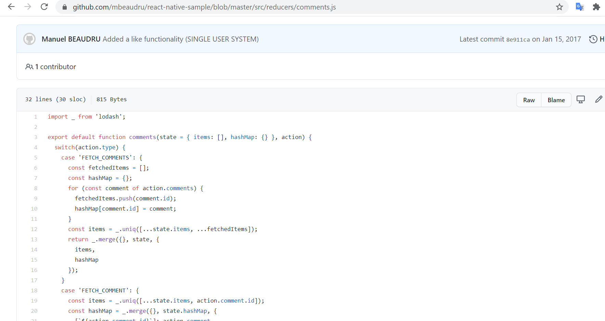
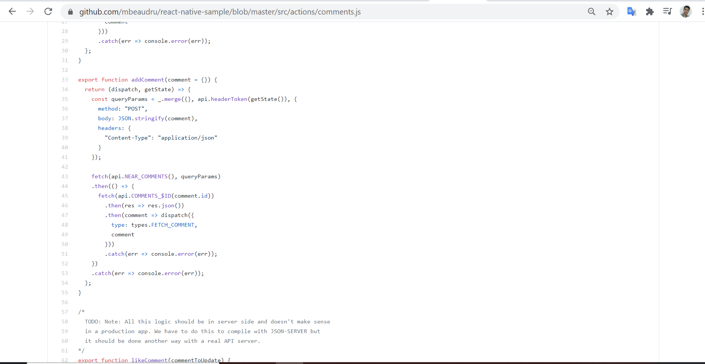

# 06 - React Reduct

## Tujuan Pembelajaran

1. Mahasiswa dapat memahami konsep state management dalam redux
2. Mahasiswa dapat menerapkan redux dalam reactapp

## Hasil Praktikum

### Praktikum 1

[Source Code index.js](../../src/06_React_Reduct/index.js)

[Source Code App.js](../../src/06_React_Reduct/App.js)

## Tugas
1 . Jelaskan maksud sintaks this.props.dispatch pada praktikum langkah 16 sebelumnya!

- jawaban
  
Berfungsi untuk memanggil dan mengirimkan ke store serta mentrigger sehingga state dapat berubah sesuai apa yang diclick.

[Link referensi](https://code.tutsplus.com/id/tutorials/getting-started-with-redux-connecting-redux-with-react--cms-30352)

2 . Jelaskan maksud istilah yang ada dalam Redux berikut ini:

a. Actions

- jawaban
  
merupakan sebuah object yang memiliki property type (String) yang mana object action ini nantinya akan dikirim ke store untuk kemudian nanti di olah oleh Reducer untuk memodifikasi data.

- [Link referensi](https://medium.com/easyread/belajar-redux-dalam-3-menit-b9afc7bc59f0)

b. Reducers

- jawaban
  
Reducer adalah bagian redux yang merubah state menjadi respon yang terjadi ketika Action di dispatch(). Sebuah fungsi yang mempunyai kembalian data.

- [Link referensi](https://medium.com/easyread/belajar-redux-dalam-3-menit-b9afc7bc59f0)

c. Action creators

- jawaban
  
Action Creator pada dasarnya adalah suatu fungsi yang menghasilkan action (mengembalikan suatu aksi).

- [Link referensi](https://refactory.id/post/5148-penggunaan-redux-untuk-react-native-2/)

d. Middleware

- jawaban
  
middleware adalah beberapa kode yang dapat Anda letakkan di antara framework yang menerima permintaan, dan framework yang menghasilkan respons.

- [Link referensi](https://medium.com/skyshidigital/manajemen-state-redux-dengan-middleware-820fe4fbe6c0)

e. Pure functions

- jawaban
  
adalah fungsi yang selalu memberi nilai balik yang sama selama argumennya sama.Tidak mengubah (mutate) objek atau variabel lain dan tidak tergantung/
terpengaruh objek atau variabel lain

- [Link referensi](https://masputih.com/2017/12/manajemen-state-dengan-redux-tanpa-react)

f. Immutability

- jawaban
  
Merupakan object yang tidak dapat dimodifikasi kembali setelah dibuat.

- [Link referensi](https://daveceddia.com/react-redux-immutability-guide/)

3 . Jelaskan maksud sintaks export default connect(mapStateToProps)(Counter) pada praktikum langkah 9 sebelumnya!

- jawaban
  
Sintaks yang memiliki fungsi menghubungkan react component ke Redux Store.

- [Link referensi](https://react-redux.js.org/api/connect)

4 . Carilah sebuah studi kasus aplikasi yang cukup kompleks di GitHub yang memanfaatkan Redux! Kemudian screenshot bagian kode program mana yang merupakan proses Redux dan jelaskan prosesnya! (cantumkan link repository GitHub yang Anda temukan)

- jawaban
- [Link Github](https://github.com/mbeaudru/react-native-sample)

- Screenshot app dan program
  

Penjelasan :

Action pada program comment akan menambah komen kemudian dapat memanggil reducer sehingga reducer mengambil data dari state lalu akan menaruh data pada store.