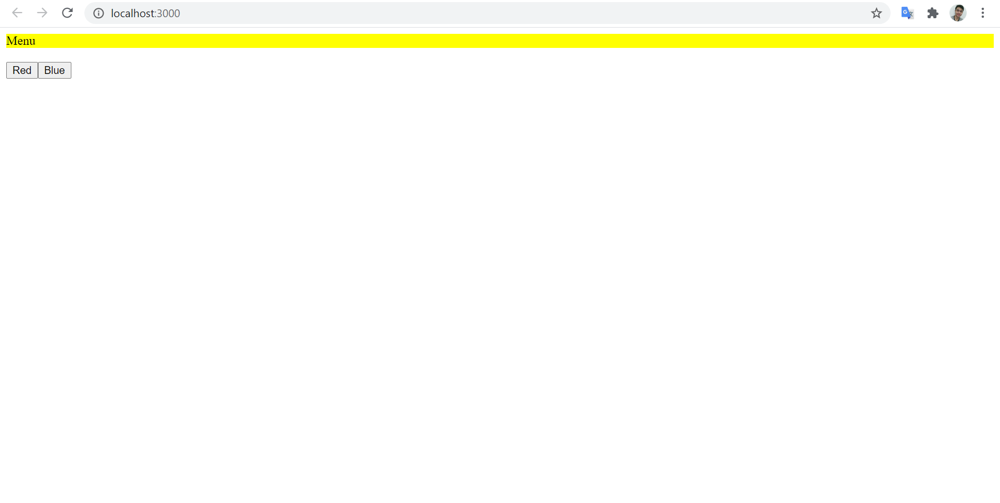
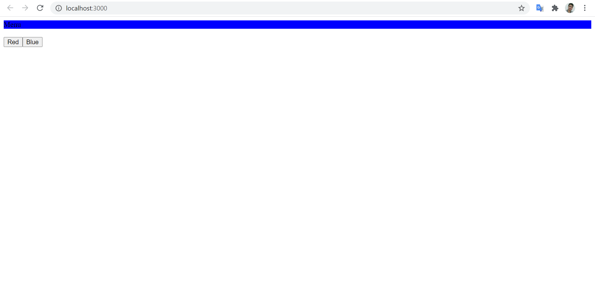
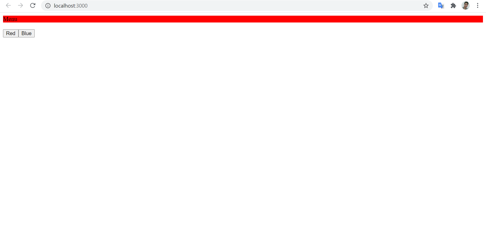

# 07 - Context API dan HOC

## Tujuan Pembelajaran

1. Mahasiswa mengetahui dan memahami konsep Context dan HOC dalam reactApp
2. Mahasiswa dapat membuat HOC dengan context API

## Hasil Praktikum

### Praktikum 1

[Source Code index.js](../../src/07_Context_dan_HOC/index.js)

[Source Code App.js](../../src/07_Context_dan_HOC/App.js)

[Source Code Menu.js](../../src/07_Context_dan_HOC/Menu.js)

[Source Code setColor.js](../../src/07_Context_dan_HOC/setColor.js)

[Source Code theme-context.js](../../src/07_Context_dan_HOC/theme-context.js)

[Source Code ThemeProvider](../../src/07_Context_dan_HOC/ThemeProvider.js)

[Source Code withTheme.js](../../src/07_Context_dan_HOC/withTheme.js)