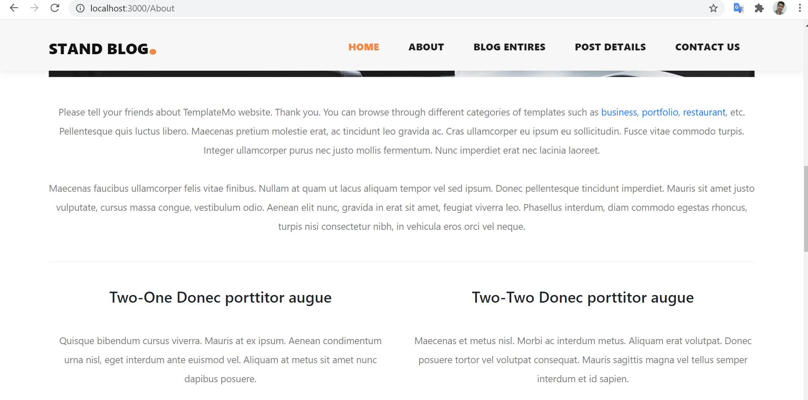
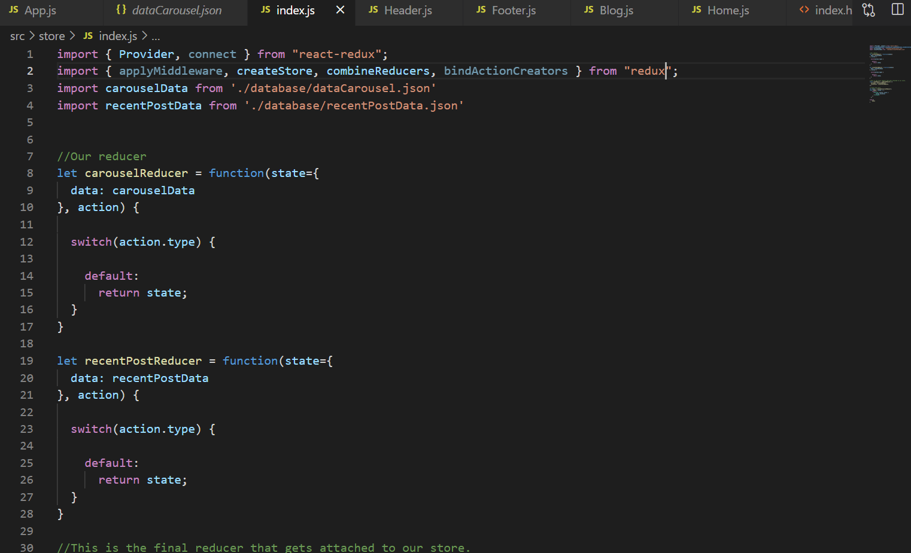

# 08 - 	UTS

## Hasil Pengerjaan UTS
 

## Halaman Home

[Source Code Home.js](../../src/08_UTS/src/pages/Home.js)
 
 

## Halaman About 

[Source Code About.js](../../src/08_UTS/src/pages/About.js)
 
 

## Halaman Blog Entires

[Source Code Blog Entires.js](../../src/08_UTS/src/pages/Blog.js)
 
 

## Halaman Post Details

[Source Code Post Details.js](../../src/08_UTS/src/pages/Details.js)
 
 

## Halaman Contact Us

[Source Code Contact Us.js](../../src/08_UTS/src/pages/Contact.js)
 
 

## Router pada App.js

[Source Code App.js](../../src/08_UTS/src/App.js)
 
 

## Data - API

[Source Code dataCarousel.json](../../src/08_UTS/src/store/database/dataCarousel.json)
 
 

## Penggunaan React Redux

### Pada index.js (/src/store)

 
 

### Pada App.js

 
 

### Pada Home.js (/src/pages)

 
 

## index.js (src)

[Source Code index.js](../../src/08_UTS/src/index.js)
 
 

## index.html

[Source Code index.html](../../src/08_UTS/public/index.html)
 
 

## Penataan Folder

