# 09 - Global API dan Hooks

## Tujuan Pembelajaran

1. Mahasiswa mengetahui dan memahami konsep Global API
2. Mahasiswa dapat membuat interaksi dengan global API dan React Hooks

## Hasil Praktikum

### 1. Membuat Global API Service GET
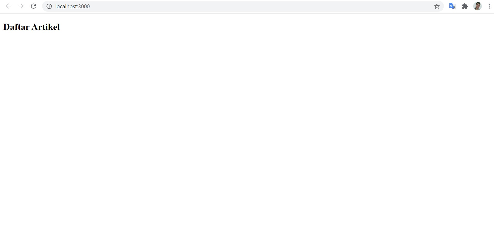

### 2. Membuat Restful API Lokal
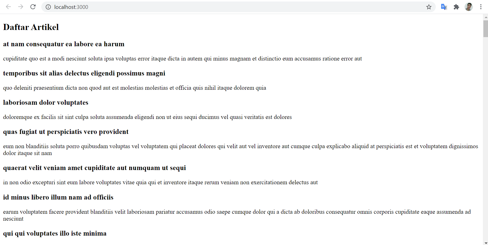

### 3. Membuat Global API Service POST
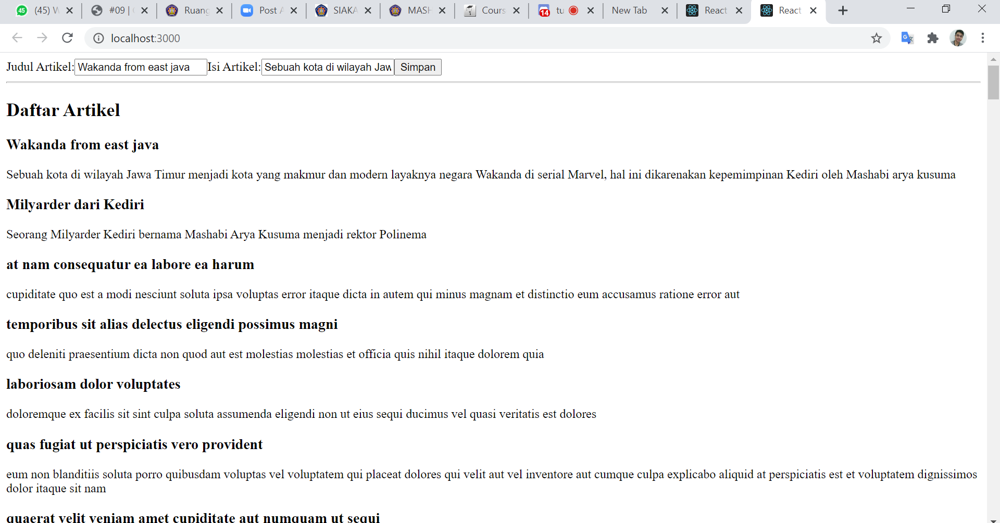

### 4. Membuat Global API Service DELETE
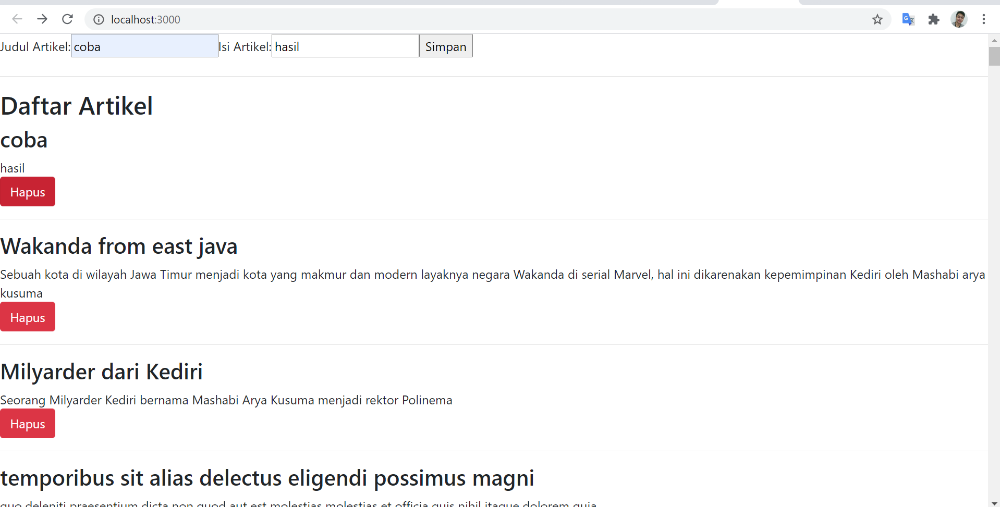
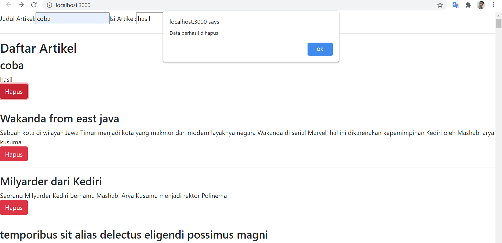
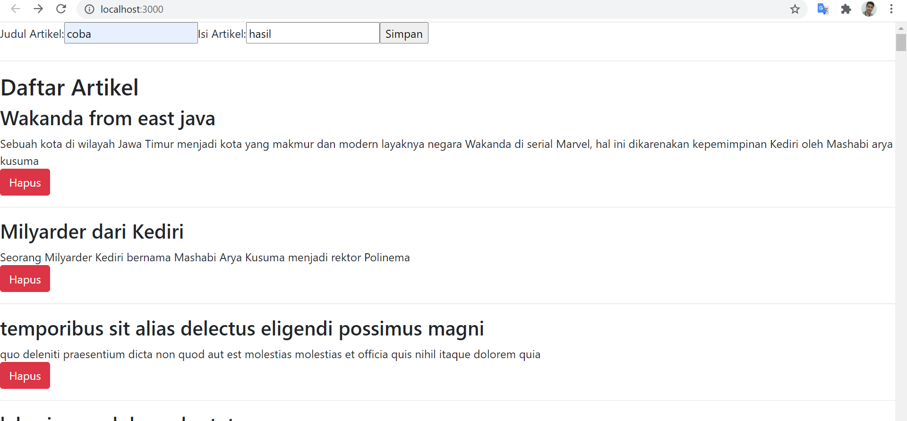

### 5. Mengelola Global API Service
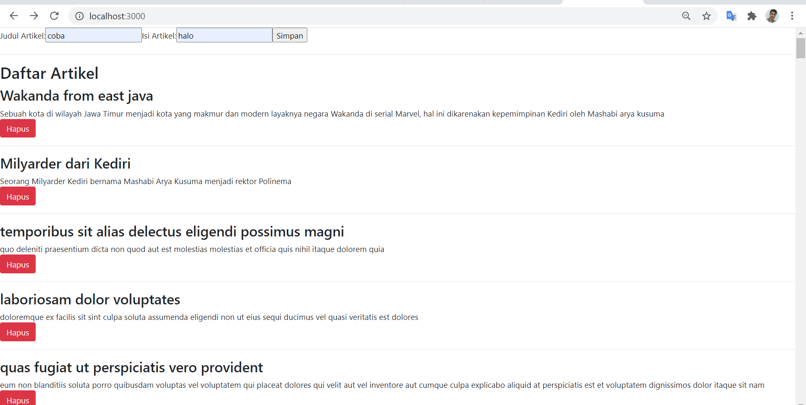
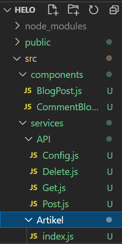

## TUGAS

- menambah artikel
  

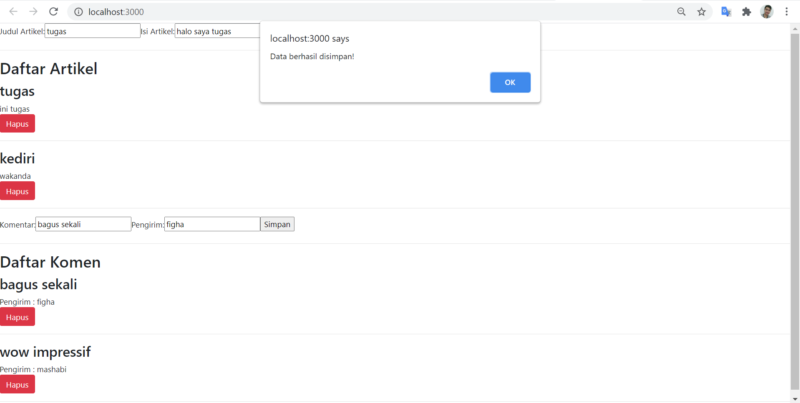
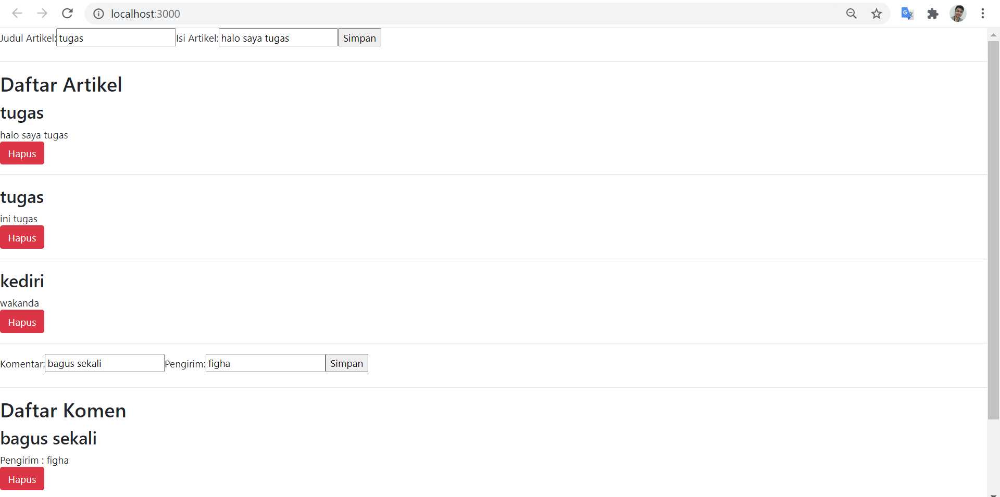
  

- menghapus tugas
  

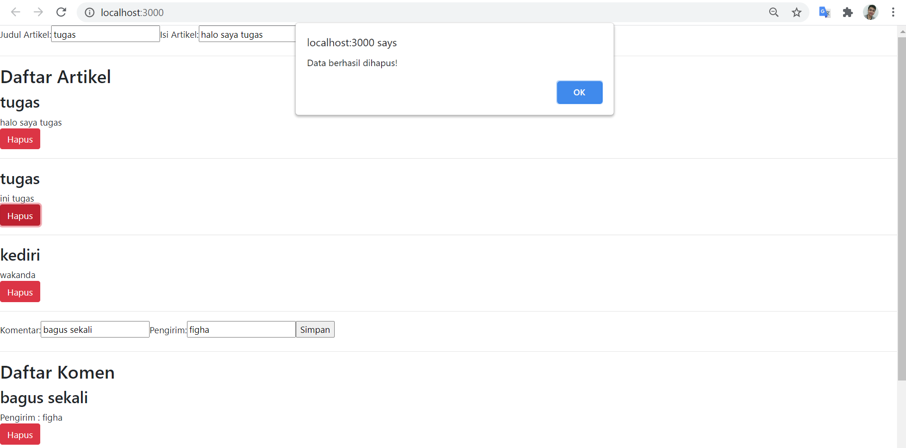
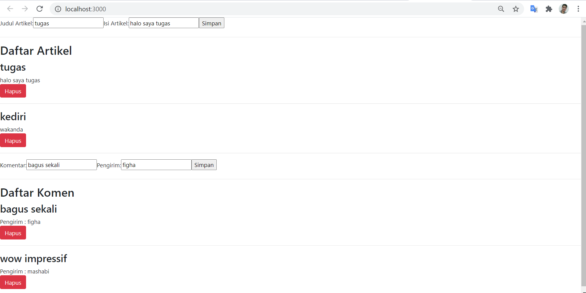
  

- menambah komen
  

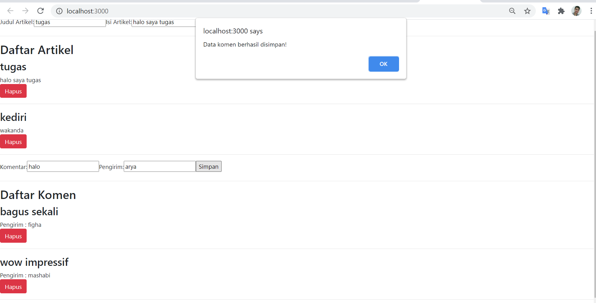
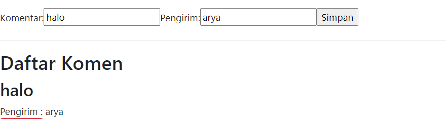
  

- menghapus komen
  

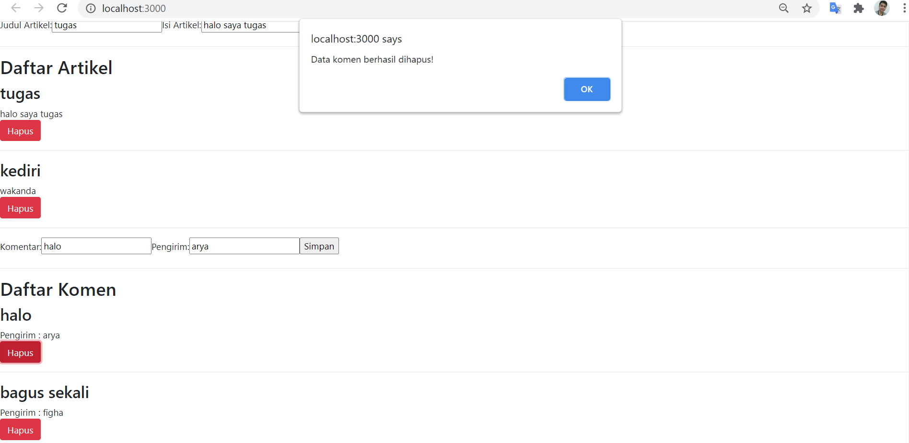
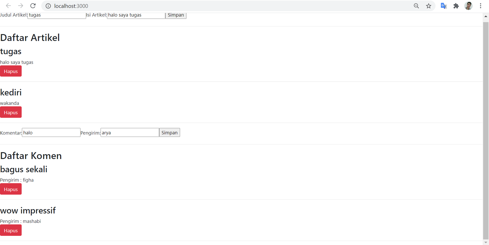
  

[Kode Program BlogPost.js](../../src/09_Global_Api_Hooks/src/components/BlogPost.js)

[Kode Program App.js](../../src/09_Global_Api_Hooks/src/App.js)

[Kode Program index.js](../../src/09_Global_Api_Hooks/src/index.js)

[Kode Program listArtikel.json](../../src/09_Global_Api_Hooks/listArtikel.json)

[Kode Program Config.js](../../src/09_Global_Api_Hooks/src/services/API/Config.js)

[Kode Program Delete.js](../../src/09_Global_Api_Hooks/src/services/API/Delete.js)

[Kode Program Get.js](../../src/09_Global_Api_Hooks/src/services/API/Get.js)

[Kode Program Post.js](../../src/09_Global_Api_Hooks/src/services/API/Post.js)

[Kode Program Artikel/index.js](../../src/09_Global_Api_Hooks/src/services/Artikel/index.js)

[Kode Program CommentBlog.js](../../src/09_Global_Api_Hooks/src/components/CommentBlog.js)

[Kode Program Komentar/index.js](../../src/09_Global_Api_Hooks/src/services/Komentar/index.js)