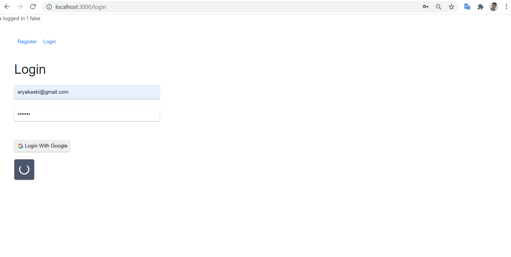

# 10 - Firebase dan ReactJS

## Tujuan Pembelajaran

1. Mahasiswa mengetahui dan memahami konsep firebase
2. Mahasiswa dapat membuat koneksi ke firebase dengan ReactJS

## Hasil Praktikum

### 1. Membuat Form Register

### 2. Membuat Form Login

### 3. Membuat Koneksi ke Firebase

  

## TUGAS

### 1. Dari praktikum sebelumnya, tambahkan aksi pada tombol "Login with Google" dan "Logout" agar bisa melakukan login dan logout dengan akun Google yang sudah kita miliki.
  

## Jawaban

Regsiter with google

Login with google

Logout

Authentication

### 2. Tambahkan animasi loading saat melakukan registrasi dan login. Boleh menggunakan dari tema boostrap atau lainnya.
  

## Jawaban

Loading

Logged In true

[Kode Program Register.js](../../src/10_Firebase_Reactjs/src/components/Register.js)

[Kode Program Header.js](../../src/10_Firebase_Reactjs/src/components/Header.js)

[Kode Program Login.js](../../src/10_Firebase_Reactjs/src/components/Login.js)

[Kode Program routes.js](../../src/10_Firebase_Reactjs/src/components/routes.js)

[Kode Program App.css](../../src/10_Firebase_Reactjs/src/App.css)

[Kode Program App.js](../../src/10_Firebase_Reactjs/src/App.js)

[Kode Program firebase.config.js](../../src/10_Firebase_Reactjs/src/firebase.config.js)

