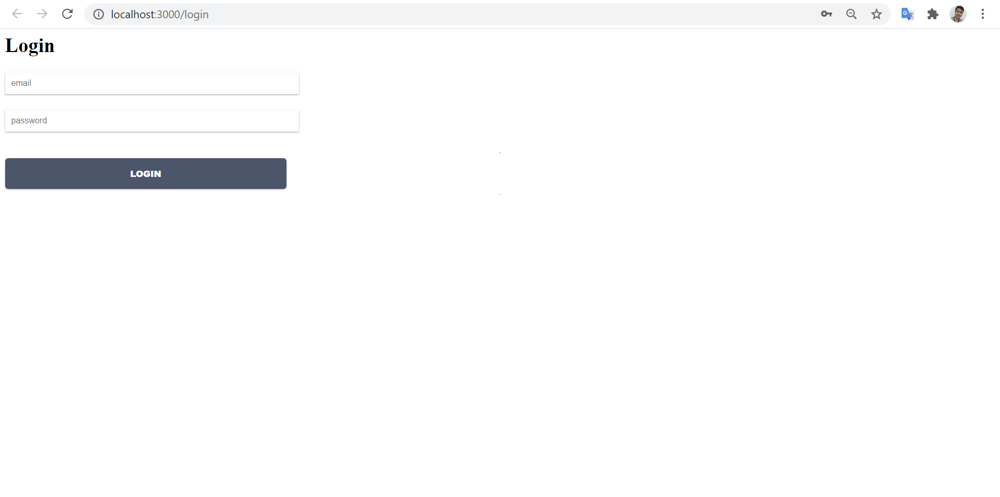
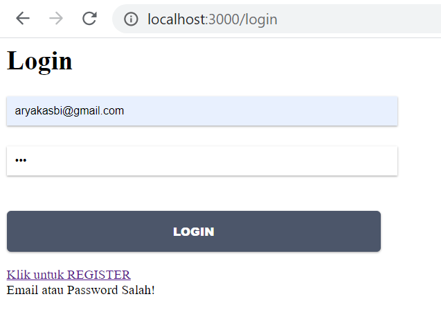
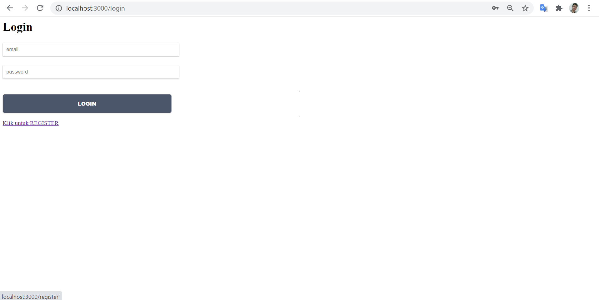
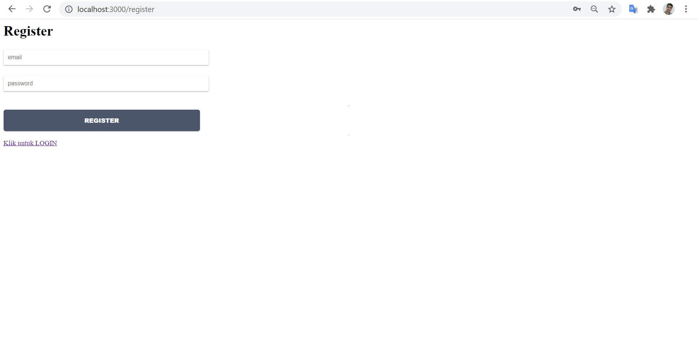
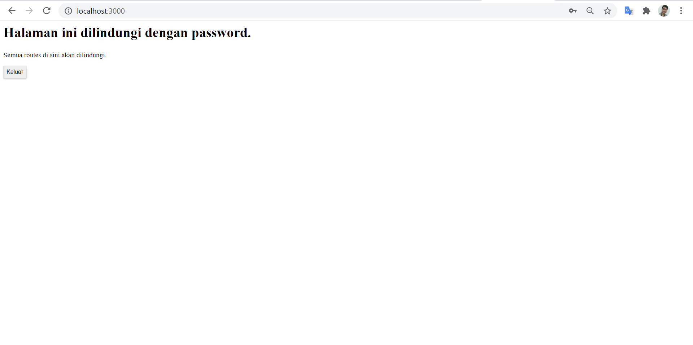

# 11 - Redux Thunk

## Tujuan Pembelajaran

1. memahami KoKonsep dan implementasi Redux-Thunk di ReactJS
2. memahami Konsep dan implementasi Firebase Login dengan Redux-Thunk di ReactJS

## Hasil Praktikum

### Membuat Login dengan Firebase dan Redux Thunk

  

## TUGAS

1. Berdasarkan praktikum yang telah Anda lakukan, jelaskan perbedaan fitur yang ada dalam komponen Login dan Home! Mengapa komponen Login tidak menggunakan class seperti pada komponen Home ?

- Jawab : Perbedaanya adalah pada halaman login terdapat fitur isAuthenticated untuk melakukan pengecekan apakah user sudah login atau belum. Sedangkan pada halaman home tidak memiliki fitur tersebut.

2. Jelaskan kegunaan dan alur logika dari protectedRoute.js !

- Jawab : Kegunaanya adalah untuk melakukan pencegahan saat halaman berpindah sebelum login atau logout dilakukan. Alur tersebut dimulai dari verifikasi kemudian melakukan pengecekan otentifikasi. Jika berhasil maka akan terbuka komponen Home yang dituju, namun jika gagal akan kembali pada halaman Login.

3. Coba lakukan login dengan email atau password yang salah, apa yang terjadi? Jelaskan!.

- Jawab : Kita akan tetap pada halaman Login (tidak berpindah) dan muncul notifikasi " email atau password salah! ". 

4. Jika Anda berada di halaman Home, coba akses form login tanpa melakukan logout. Apakah form login bisa diakses? Jelaskan!

- Jawab : Tidak, karena ada alur dari protectedRoute tadi yang melakukan verifikasi data.

5. Tambahkan menu Register pada form login sehingga user yang belum terdaftar dapat melakukan registrasi! Jika registrasi sukses, maka user langsung diarahkan ke halaman Home

- Jawab : 

Halaman Login
Halaman Register
Halaman Home

## File Project :
[Kode Program firebase.config.js](../../src/11_Redux_Thunk/src/firebase.config.js)

[Kode Program auth.js (redux/actons/auth)](../../src/11_Redux_Thunk/src/redux/actions/auth.js)

[Kode Program auth.js (reducers/auth)](../../src/11_Redux_Thunk/src/redux/reducers/auth.js)

[Kode Program index.js (reducers)](../../src/11_Redux_Thunk/src/redux/reducers/index.js)

[Kode Program configureStore.js](../../src/11_Redux_Thunk/src/redux/configureStore.js)

[Kode Program Login.js](../../src/11_Redux_Thunk/src/components/Login.js)

[Kode Program Home.js](../../src/11_Redux_Thunk/src/components/Home.js)

[Kode Program Register.js](../../src/11_Redux_Thunk/src/components/Register.js)

[Kode Program routes.js](../../src/11_Redux_Thunk/src/components/routes.js)

[Kode Program protectedRoute.js](../../src/11_Redux_Thunk/src/routes/protectedRoute.js)

[Kode Program Root.js](../../src/11_Redux_Thunk/src/root.js)

[Kode Program App.js](../../src/11_Redux_Thunk/src/App.js)

