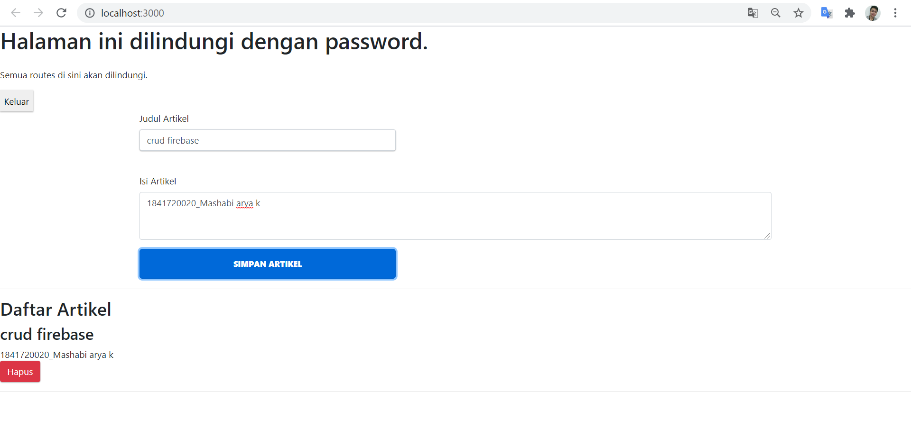
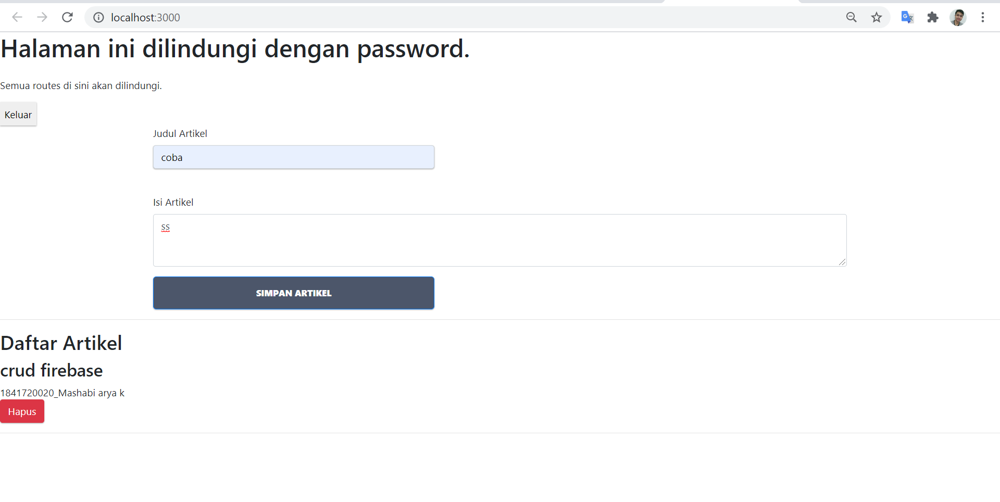
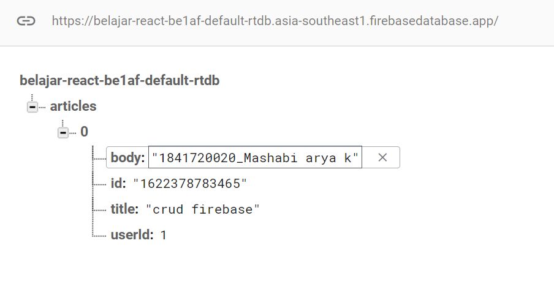

# 12 - CRUD Firebase

## Tujuan Pembelajaran

1. Mahasiswa memahami konsep interaksi dengan firebase
2. Mahasiswa dapat membuat komunikasi CRUD ke firebase dengan ReactJS

## Hasil Praktikum :

### Praktikum 2 Membuat Fungsi Create Artikel

### Praktikum 3 Membuat Fungsi Hapus Artikel

<!-- ### Praktikum 4

# Tugas

 -->

File Project : [Source Code](../../src/12_crud_firebase/src)