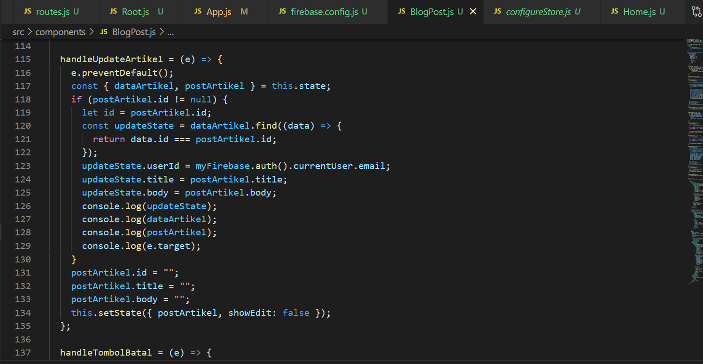

# 12 - CRUD Firebase

## Tujuan Pembelajaran

1. Mahasiswa memahami konsep interaksi dengan firebase
2. Mahasiswa dapat membuat komunikasi CRUD ke firebase dengan ReactJS

## Hasil Praktikum :

### Praktikum 2 Membuat Fungsi Create Artikel

### Praktikum 3 Membuat Fungsi Hapus Artikel

### Praktikum 4

# Tugas

1. Berdasarkan praktikum 1 yang telah Anda lakukan, jelaskan perbedaan fungsi locked mode dan test mode pada langkah 3 saat Anda konfigurasi database Firebase?
2. Buatlah variabel userId pada praktikum 2 langkah 4 agar dapat menyimpan email dari user yang sedang login, sehingga dapat tersimpan di database!
3. Jelaskan maksud kode ini (dataArtikel || []) pada praktikum 2 langkah 6! Mengapa berbeda dari codelabs sebelumnya untuk menampilkan daftar artikel?
4. Lengkapilah kode pada praktikum 4 langkah 5 agar dapat melakukan update artikel! Mengapa setelah klik tombol Update Artikel, form Modal tidak hilang? Bagaimana Anda mengatasi hal tersebut?
5. Ketika Anda menekan tombol Edit, lalu menekan tombol Batal pada form Modal update artikel. Kemudian coba tambah artikel baru, maka artikel yang tadi kita klik tombol Edit akan berubah jadi data yang artikel baru ditambahkan. Mengapa demikian? Silakan diperbaiki.

*Jawaban :*

1. Perbedaan fungsi locked mode dan test mode adalah pada penulisan dan pembacaan data. Ketika masuk locked mode, maka data tidak akan bisa diakses karena pada pengaturannya diatur 'false' dan pada test mode, data bisa diakses dan diolah.

2. Isi pada userId diubah menjadi `firebase.auth().currentUser.email`

3. Perintah tersebut berfungsi untuk menampilkan map data dalam bentuk array maupun object. Pada codelabs sebelumnya tidak seperti itu karena data yang diambil hanya berbentuk object.

4. Karena pada showEdit tidak diubah menjadi false, sehingga modal tidak menghilang.

5. Karena pada onSubmit form modal dapat memanggil fungsi ' handleTombolSimpan ', yang mana data baru  dapat tersimpan.
  
Perbaikan :

[Kode Program BlogPost.js](../../src/12_crud_Firebase/src/components/BlogPost.js)