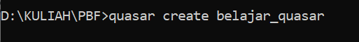
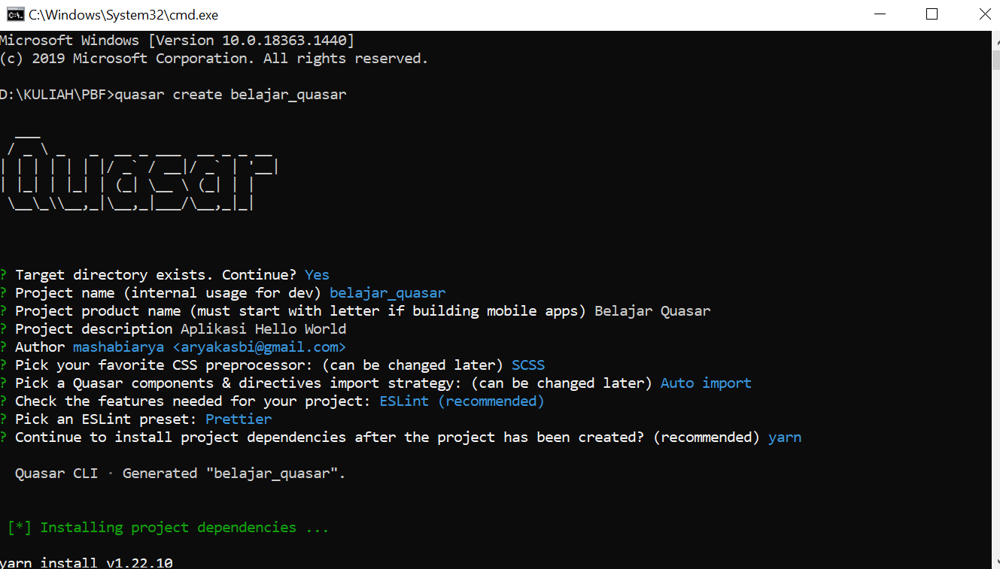
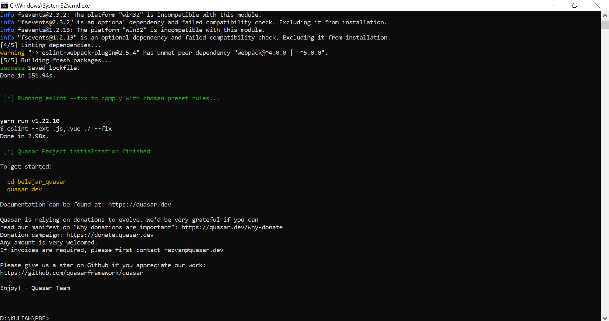
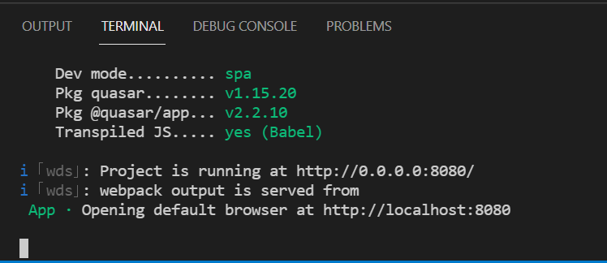
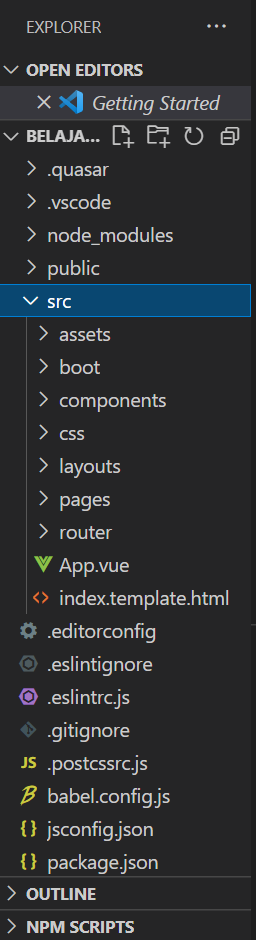
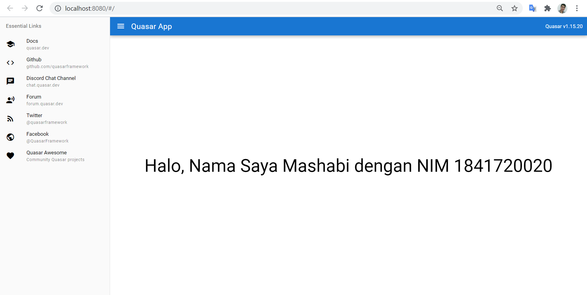

# 13 - Pengenalan Quasar Framework

## Tujuan Pembelajaran

1. Mampu memahami konsep Quasar Framework
2. Mampu menerapkan aplikasi pertama dengan Quasar Framework

## Hasil Praktikum :

### Praktikum 1 Memulai Quasar Framework

### Praktikum 2 Membuat Aplikasi Pertama

# Tugas Praktikum

1. Berdasarkan praktikum 1 yang telah Anda lakukan, jelaskan kegunaan file quasar.conf.js ?
2. Jelaskan maksud istilah SPA, SSR, PWA, BEX, Electron app, Cordova, dan Linting code!
3. Jelaskan maksud dan perbedaan ES6, ECMAScript 6, dan ECMAScript 2015 !

*Jawaban :*

1. Fungsinya adalah untuk menyimpan konfigurasi mengenai project yang akan dibuat.

2. Penjelasan istilah SPA, SSR, PWA, BEX, Electron app, Cordova, dan Linting code : 
  
SPA : Website yang menggunakan 1 halaman saja sebagai tampilan pada aplikasinya.
  
SSR : Teknik yang digunakan dalam pengembangan web yang melibatkan penggunaan script pada serevr web yang menghassilkan response yang disesuaikan untuk permintaan setiap pengguna ke situs web.
  
PWA : Sebuah aplikasi web yang menggunakan beberapa teknologi modern yang membuat user experience seperti menggunakan Native App.
  
BEX : Sebuah aplikasi dalam ekstensi web yang digunakan untuk menyesuaikan web browser dengan beberapa cara.
  
Electron app : Framework yang digunakan untuk membangun aplikasi berbasis dekstop (dapat dijalankan dengan semua sistem operasi).
  
Cordava : Framework yang digunakan untuk mengembangkan aplikasi mbile.
  
Linting code : Proses pengecekan code kesalahan program dan style program.

3. Revisi yang kedua untuk javascript, ECMAScript 6 juga dikenal dengan sebutan ES6 atau ECMAScript2015. Jadi, cara menyebutnya saja yang berbeda.

[Kode Program Index.vue](../../src/13_Pengenalan_Quasar_Framework/src/pages/Index.vue)