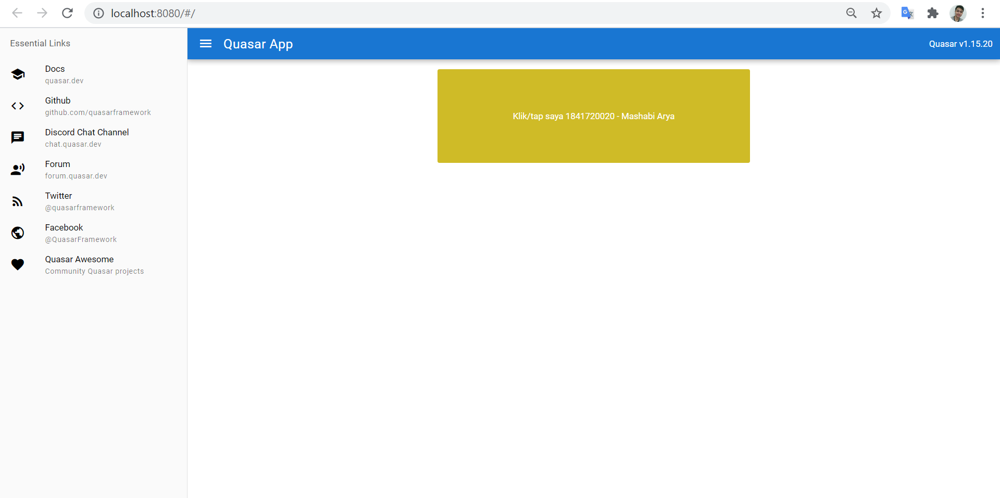
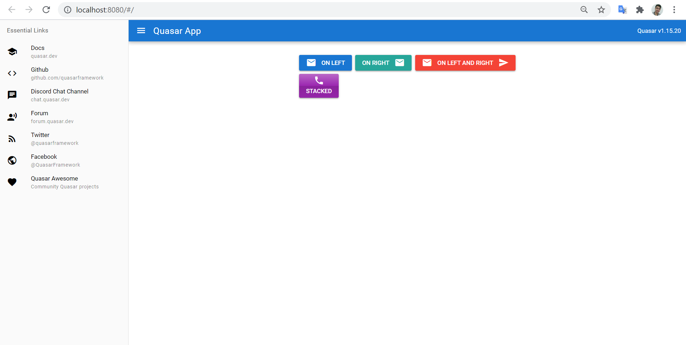
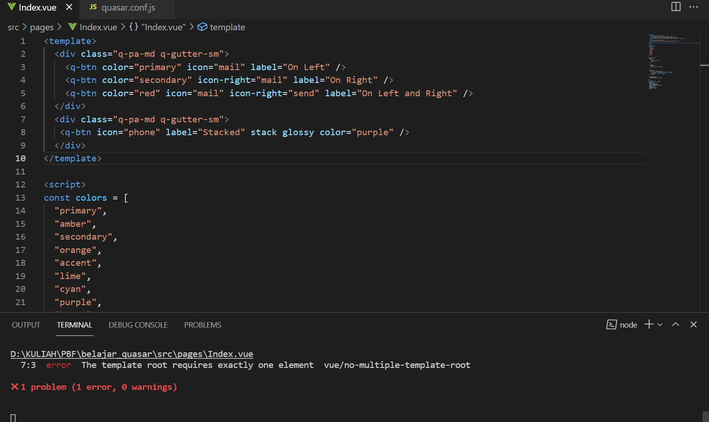
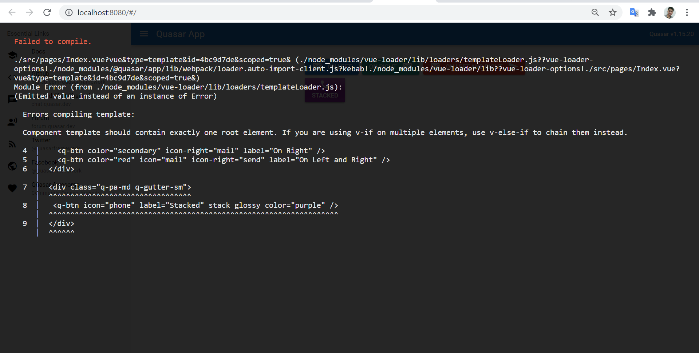

# 14 - Quasar Directives dan Components

## Tujuan Pembelajaran

1. Mampu menerapkan Quasar Directives
2. Mampu menerapkan Quasar Components

## Hasil Praktikum :

### Praktikum 1 Menggunakan Quasar Directives

### Praktikum 2 Menggunakan Quasar Components

# Tugas Praktikum

1. Berdasarkan praktikum 1 yang telah Anda lakukan, jelaskan maksud kode di template: class="q-pa-md row justify-center" ?
2. Berdasarkan praktikum 1 pada langkah nomor 4, jelaskan maksud script tersebut seperti kegunaan konstanta colors, fungsi data(), computed, mounted, dan beforeDestroy() !
3. Berdasarkan praktikum 2 pada langkah nomor 2, jelaskan maksud tiap kode HTML pada template yang mendefinisikan tiap button tersebut!
4. Coba ganti kode template HTML pada praktikum 2 menjadi seperti berikut. Save file, lalu perhatikan apa yang terjadi ? Mengapa terjadi demikian, jelaskan!

*Jawaban :*

1. Kode tersebut digunakan untuk mengatur utilitas peralatan flexbox untuk menyelaraskan kolom secara horizontal.
  

2. Kegunaan konstanta colors, fungsi data(), computed, mounted, dan beforeDestroy()
  
- Colors : Berfungsi untuk mendefinisikan warna yang akan ditampilkan.
  
- Fungsi data() : Digunakan untuk mereturn warna.
  
- Computed : Sebutan untuk cumputed property adalah classes, yang mana hanya dapat mengembalikan properti pada color.
  
- Mounted : Digunakan untuk memicu perubahan warna dengan interval yang sudah dituliskan.
  
- beforeDestroy : Digunakan untuk memanggil this.timer tepat sebelum instance vue destroy.
  

3. Kode HTML :
- div class-"q-pa-md row justify-center"
  
berarti button nantinya akan berjajar dengan rata justify-center secara horizontal.
  
- div class-"q-pa-md q-gutter-sm"
  
digunakan untuk mengatur lebar setiap button
  
- q-btn color-"primary" icon-"mail" label-"On Left"
  
berarti terdapat button biru dengan icon mail bertuliskan on Left
  
- q-btn color="secondary" icon-right="mail" label="On Right"
  
berarti terdapat button warna hijau dengan icon mail bertuliskan On Right.
  
- q-btn color="red" icon="mail" icon-right-"send" label="On Left and Right"
  
berarti terdapat button warna merah dengan icon mail bertuliskan On Left and Right.
  
- q-btn icon="phone" label="Stacked" stack glossy color="purple"/>
  
berarti pada baris baru ada button berwarna ungu glossy dengan icon phone yang bertuliskan Stacked

4. Terjadi error karena root pada template hanya membutuhkan satu elemen vue.

[Kode Program Index.vue](../../src/14_quasar_directives_components/src/pages/Index.vue)

[Kode Program quasar.conf.js](../../src/14_quasar_directives_components/quasar.conf.js)